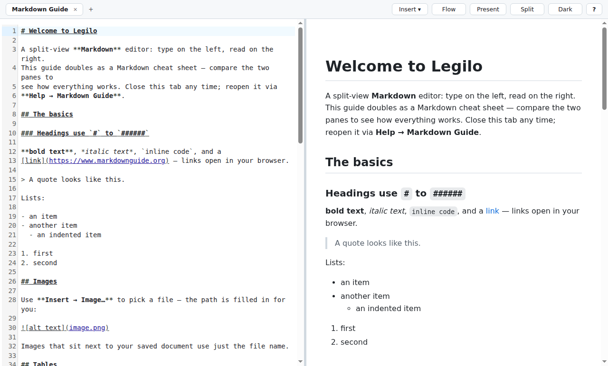
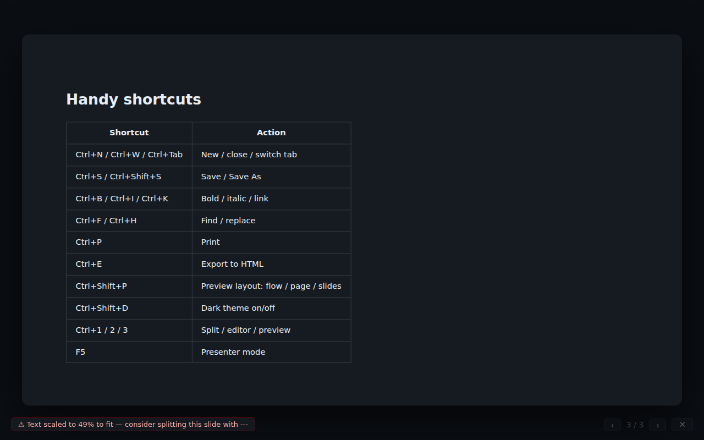
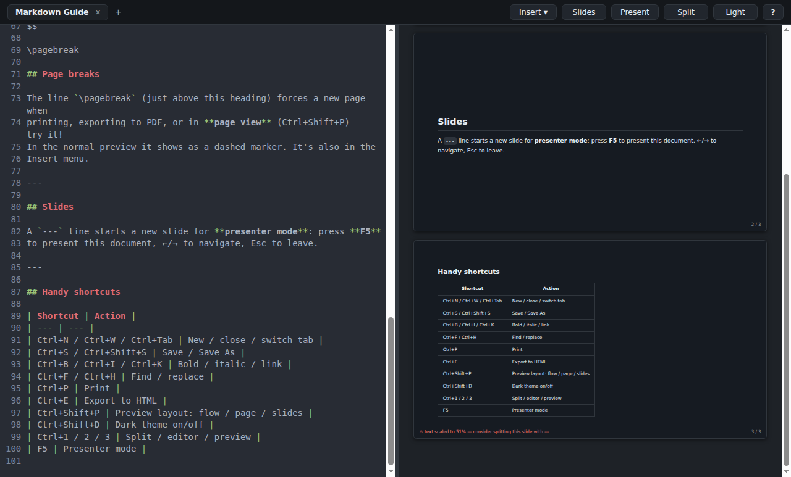

<div align="center">


# Legilo

**Write it once. Read it, present it, print it.**

Legilo is a split-view Markdown editor that turns one plain-text document into
a live preview, a slide deck, and a print-ready paper — without ever leaving
the app.




</div>

## ✍️ Write

- **Split view** — CodeMirror editor on the left, live GitHub-style preview on
  the right, with synchronized scrolling and a draggable divider
- **Tabs** that reopen exactly where you left off, with unsaved-changes guards
- **Find & replace** (`Ctrl+F` / `Ctrl+H`) with regex and whole-word options
- **Insert menu & right-click menus** — images via a file picker, tables, code
  blocks, task lists, footnotes, links… no syntax to memorize
- **Spellcheck** with suggestions, straight from your OS dictionary
- **Everything Markdown**: GitHub-flavored tables, task lists, footnotes,
  fenced code with syntax highlighting — plus **KaTeX math**
  (`$E = mc^2$` and `$$…$$` blocks)
- Opening an **HTML file converts it to Markdown** automatically

## 🎤 Present

Any document is already a slide deck: a `---` line starts a new slide.

- **Presenter mode** (`F5`) — fullscreen slides with keyboard/click navigation
- **Slides layout** in the preview pane, to review your deck while writing
- Overfull slides **auto-shrink to fit** and show a hint so you know when to
  split them

<div align="center">

</div>

## 📄 Print & export

- **Page view** — Word-like sheets (A4 or US Letter) that show exactly how
  your document fills printed pages while you type
- **`\pagebreak`** forces a new page — in the preview, in print, and in PDF
- **Print** (`Ctrl+P`), **print preview**, **Export to PDF** and **Export to
  HTML** — all styled, math and code highlighting included

## 🎨 Make it yours

- **Light & dark themes** (`Ctrl+Shift+D`)
- **Preview styles**: GitHub, Book (serif, print-friendly), or Minimal
- **Bring your own CSS** — load any stylesheet targeting `.markdown-body`
- Window size, theme, layout, and open tabs are remembered between sessions

<div align="center">

</div>

## Install

Grab the latest installer from the [Releases](../../releases) page:

| OS | File |
| --- | --- |
| Windows | `Legilo Setup <version>.exe` (also available in the Microsoft Store) |
| macOS | `Legilo-<version>.dmg` — unsigned: right-click → Open the first time |
| Linux | `Legilo-<version>.AppImage` or `.deb` |

## Build from source

```bash
git clone https://github.com/Friso1987/legilo.git
cd legilo
npm install
npm start        # development mode
npm run dist     # build installers for your OS
```

<details>
<summary>Linux dev note: Chromium sandbox error on <code>npm start</code></summary>

If Electron aborts with `chrome-sandbox is owned by root and has mode 4755`,
either run `npm run start:linux` (dev-only, unsandboxed) or fix the helper
once per install:

```bash
sudo chown root:root node_modules/electron/dist/chrome-sandbox
sudo chmod 4755 node_modules/electron/dist/chrome-sandbox
```

</details>

Releases are built for all three platforms by GitHub Actions: push a tag like
`v0.2.0` (`npm version 0.2.0 && git push --follow-tags`) and the installers
appear on a draft GitHub release.

### Project layout

```
main.js            # Electron main process: window, native menus, dialogs, printing
preload.js         # contextBridge API (contextIsolation + sandbox on)
src/renderer.js    # editor, preview, presenter, pagination (bundled by esbuild)
renderer/          # app shell, styles, generated bundles
```

## Keyboard shortcuts

| | |
| --- | --- |
| `Ctrl+N` / `Ctrl+W` / `Ctrl+Tab` | New / close / switch tab |
| `Ctrl+O` / `Ctrl+S` / `Ctrl+Shift+S` | Open / Save / Save As |
| `Ctrl+B` / `Ctrl+I` / `Ctrl+K` | Bold / italic / link |
| `Ctrl+F` / `Ctrl+H` | Find / replace |
| `Ctrl+P` / `Ctrl+E` | Print / export HTML |
| `Ctrl+1` `2` `3` | Split / editor / preview |
| `Ctrl+Shift+P` | Preview layout: flow / page / slides |
| `Ctrl+Shift+D` | Dark theme |
| `F5` | Presenter mode |

## License

[MIT](LICENSE)
