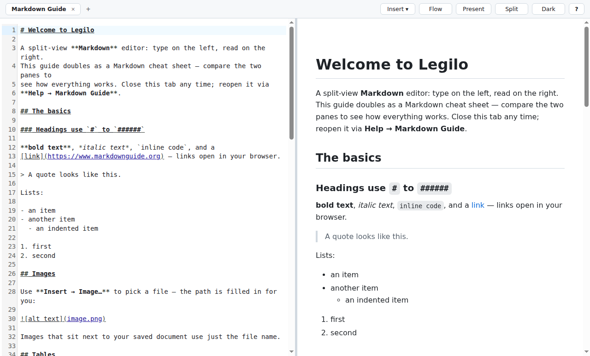
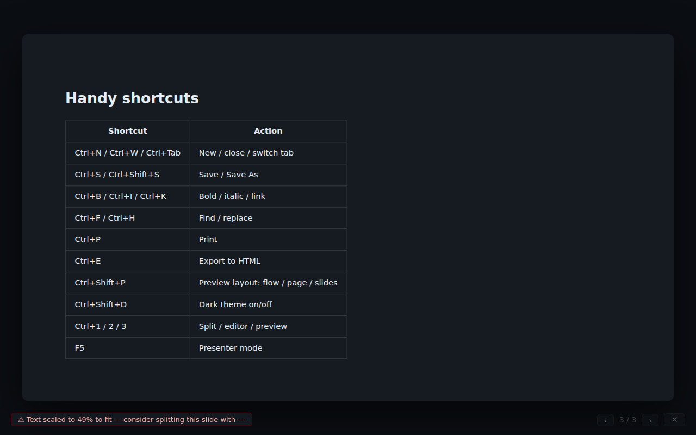
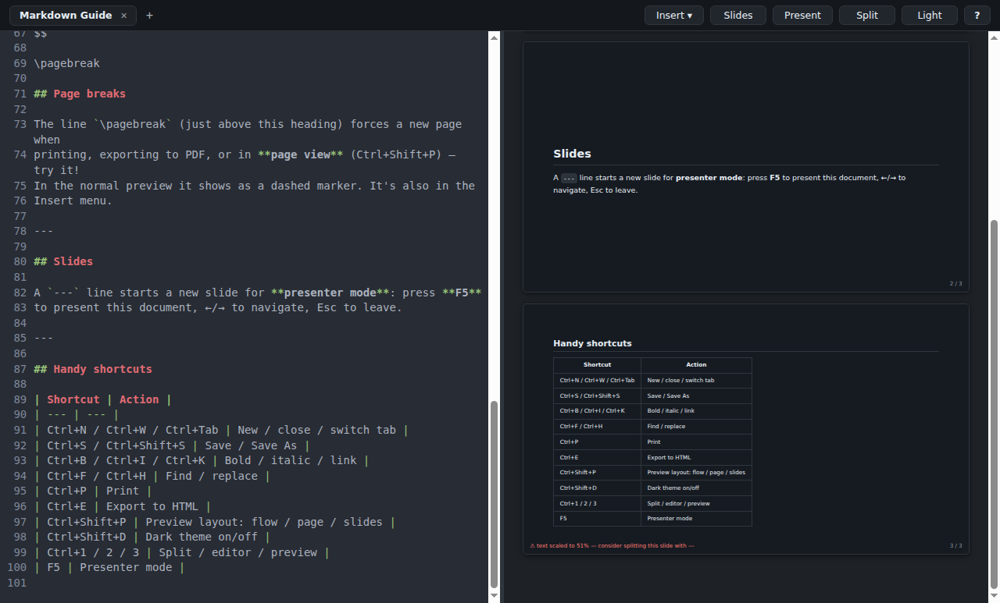

<div align="center">


# Legilo

**Markdown for teachers. Prepare a lesson, teach it live, hand it out.**

Legilo is a split-view Markdown editor built for the classroom. You write one
plain-text document, and it becomes your lesson notes, the slides you project,
and the handout you print or send afterwards. No slide templates, no dragging
text boxes around.




</div>

## Why teachers like it

You type in plain Markdown, so preparing a lesson feels like writing notes
rather than building a presentation. That same file does three jobs: it's your
prep, your projected slides, and the handout you give out later.

The part that makes it work in class is that you stay in control while you
teach. The slides go on the projector, but your own screen keeps the editor
open, so you can fix a typo, jump to a question, or add an example on the spot,
and the class sees it right away.

## Prepare the lesson

A split view shows your Markdown on the left and a live preview on the right,
with synchronized scrolling and a divider you can drag.

* Insert menu and right-click menus for images, tables, code blocks, task
  lists, footnotes and links, so there's no syntax to memorize
* Spellcheck with suggestions from your operating system's dictionary
* Full Markdown: GitHub-flavored tables, task lists, footnotes and fenced code
  with syntax highlighting
* Maths with KaTeX, both inline (`$E = mc^2$`) and as `$$…$$` blocks, which is
  handy for science and maths lessons
* Diagrams from fenced ` ```mermaid ` or ` ```d2 ` blocks: flowcharts,
  timelines, cycles and concept maps, live in the preview and on your slides
* Video: paste a bare YouTube or Vimeo link on its own line and it becomes an
  embedded player; local `.mp4` and `.webm` clips work too
* Open an HTML file and Legilo converts it to Markdown, so old materials come
  across cleanly

Tabs reopen where you left off, and there's an unsaved-changes guard so you
don't lose work. Start a new slide by putting a `---` line between sections,
and use the Slides preview layout to flip through the deck while you write.

## Teach it

Press **F5** to present fullscreen, or **Shift+F5** to present on a second
screen. Move through the deck with the arrow keys, space, a clicker, or the
on-screen controls.

### Second screen, and you keep editing

**Shift+F5** puts the slides fullscreen on the projector and turns your own
screen into a presenter console: the current slide, the next slide, a timer and
clock, and your private notes, with the editor still open beside it. Change a
word and the class sees it the same second. This is the feature the whole thing
is built around.

Navigate with PageUp and PageDown (the buttons most presentation remotes send),
or the console's arrows. The arrow keys and space also work whenever you're not
typing in the editor.

### Bring the class along, one point at a time

Rather than showing a whole slide at once, you can reveal it step by step. A
line with just `. . .` on it is a pause: everything after it stays hidden until
your next click, and then fades in.

```markdown
## Photosynthesis

- Light + CO₂

. . .

- → glucose + O₂

. . .

> Where does this happen?
```

### Notes only you can see

Put reminders to yourself in `<!-- note: … -->`. They show up on your console
and never reach the projector.

```markdown
## The French Revolution

- 1789: storming of the Bastille

<!-- note: ask who's read the chapter; keep this under 3 minutes -->
```

### Annotate and steer attention

* Draw on the slide with a digital pen. The eraser end erases, it's
  pressure-sensitive, and there's a mouse fallback (**P**). Rough strokes snap
  into clean lines and circles, and each slide keeps its ink. When you're on the
  second screen, press **A** to bring the slide up on your own screen so you can
  draw on it, and the class sees every stroke live.
* Black out the screen with **B** (or white with **W**) to pull everyone's
  attention back to you. Press again to bring the slide back.
* Use the spotlight with **S** to dim everything except a circle that follows
  your pointer, so you can focus on one figure or line.
* Slides that are too full shrink to fit and warn you, so nothing runs off the
  edge in the middle of a lesson.

<div align="center">

</div>

## Hand it out

The same document exports to whatever you need, keeping your preview style,
tables, lists, code and page breaks. Diagrams and maths come across as crisp
images.

* Page view lays the document out on Word-like A4 or US Letter sheets while you
  type, and `\pagebreak` forces a new page
* Print (`Ctrl+P`), print preview, and export to PDF or HTML, all styled with
  maths, code highlighting and diagrams
* Export to Word (`.docx`) for a flowing, fully editable handout
* Export to PowerPoint (`.pptx`) with one native slide per `---`, laid out like
  presenter mode, so a colleague can open your deck in PowerPoint. YouTube links
  become native online-video objects and local `.mp4` files are embedded as
  playable media.

## Make it yours

* Light and dark themes (`Ctrl+Shift+D`), and diagrams re-render to match
* Seven preview styles: GitHub, Book (serif, print-friendly), Minimal, Academic
  (auto-numbered sections), Slate, Typewriter and Newspaper. Exports and PDFs
  follow the style you pick.
* Load your own CSS targeting `.markdown-body` if you want a custom look
* Window size, theme, layout and open tabs are remembered between sessions

<div align="center">

</div>

## Install

Grab the latest installer from the [Releases](../../releases) page:

| OS | File |
| --- | --- |
| Windows | `Legilo Setup <version>.exe` (also in the Microsoft Store) |
| macOS | `Legilo-<version>.dmg` (unsigned: right-click, then Open the first time) |
| Linux | `Legilo-<version>.AppImage` or `.deb` |

## Build from source

```bash
git clone https://github.com/Friso1987/legilo.git
cd legilo
npm install
npm start        # development mode
npm run dist     # build installers for your OS
```

<details>
<summary>Linux dev note: Chromium sandbox error on <code>npm start</code></summary>

If Electron aborts with `chrome-sandbox is owned by root and has mode 4755`,
either run `npm run start:linux` (dev-only, unsandboxed) or fix the helper once
per install:

```bash
sudo chown root:root node_modules/electron/dist/chrome-sandbox
sudo chmod 4755 node_modules/electron/dist/chrome-sandbox
```

</details>

Releases are built for all three platforms by GitHub Actions. Push a tag like
`v0.5.0` (`npm version 0.5.0 && git push --follow-tags`) and the installers show
up on a draft GitHub release.

### Project layout

```
main.js            # Electron main process: windows, second-screen window, menus, dialogs
preload.js         # contextBridge API (contextIsolation + sandbox on)
src/renderer.js    # editor, preview, presenter, dual-view sync, pagination (bundled by esbuild)
renderer/          # app shell, styles, generated bundles
```

## Keyboard shortcuts

| | |
| --- | --- |
| `Ctrl+N` / `Ctrl+W` / `Ctrl+Tab` | New / close / switch tab |
| `Ctrl+O` / `Ctrl+S` / `Ctrl+Shift+S` | Open / Save / Save As |
| `Ctrl+B` / `Ctrl+I` / `Ctrl+K` | Bold / italic / link |
| `Ctrl+F` / `Ctrl+H` | Find / replace |
| `Ctrl+P` / `Ctrl+E` | Print / export HTML |
| `Ctrl+1` `2` `3` | Split / editor / preview |
| `Ctrl+Shift+P` | Preview layout: flow / page / slides |
| `Ctrl+Shift+D` | Dark theme |
| `F5` / `Shift+F5` | Present / present on a second screen |
| `→` `←` `Space` | Next / previous (reveals `. . .` steps too) |
| `PageDown` / `PageUp` | Next / previous (presentation remotes) |
| `P` / `E` / `C` / `X` | While presenting: pen / eraser / pen colour / clear ink |
| `B` / `W` / `S` | While presenting: black out / white out / spotlight |
| `A` | Second-screen mode: pop up the slide to draw on it |

## License

[MIT](LICENSE)
